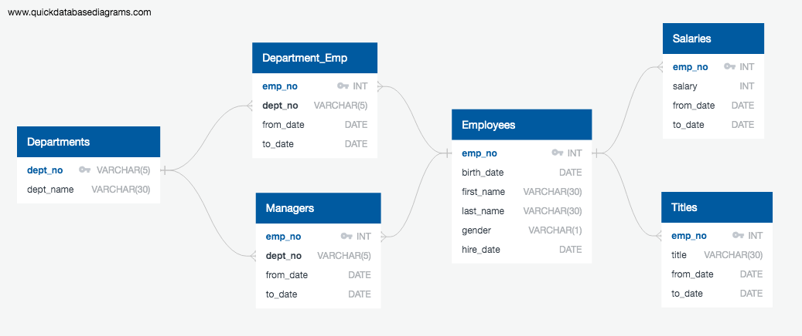

#### Goal

Use SQL to analyze data on employees of a company from the 1980s and 1990s using six CSV files.

#### Process

The first step before performing any queries was to sketch out an ERD of the tables. I used [QuickDBD](https://www.quickdatabasediagrams.com) to quickly see how the tables corresponding to each CSV file would relate to each other.  

Using the ERD, I created the schema for the tables in my database, specifying data types, and setting primary and foreign keys as appropriate. I then imported the data into these tables. 

There were nine main “questions” I wanted to answer, the first eight being done through PostgreSQL. 

For my first query, I wanted to find the employee number, last name, first name, gender, and salary of every employee. The information I needed was contained on two tables, `employees` and `salaries`, so I selected the appropriate columns and then joined those tables with an inner join on `emp_no`, which both tables had.

For the second query, I wanted to list all employees who were hired in 1986. I selected the `first_name`, `last_name`, and `hire_date` columns from the `employees` table and then used the `WHERE` clause to set the date of hire condition. 

The third query looked into managers, listing the department number and name, and the managers’ name, employee number, and employment dates. The relevant information was stored in four separate tables this time, which required three inner joins. As before, I selected the relevant columns and then joined the `dept_manager` table with the `employees` table, and the `employees` table with the `dept_emp` table, both on `emp_no`. I joined the `dept_emp` table with the `departments` table on `dept_no`. 

For the fourth query, I wanted to list the departments of every employee along with their full name and employee number. The information I needed was stored on two tables, `employees` and `departments`. However, the tables did not share any primary/foreign keys. I therefore, had to use a third table (`dept_emp`) to join the other to together. I first joined `employees` to `dept_emp` on the shared `emp_no`, and then `dept_emp` to `departments` on the shared `dept_no`. Through these joins, I was able to display the department name of each employee along with their name and employee number. 

